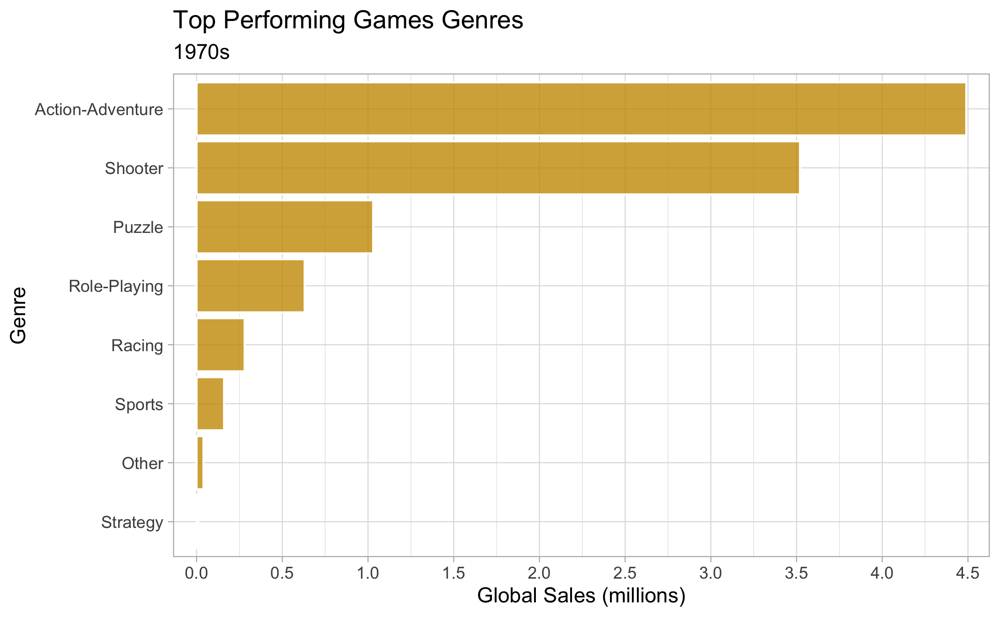

# Video Games Analysis 
# Stuart McColl

 

# Brief

You have been hired by Donkey Games, a small games developer in Dundee. They are planning their next release and want to use data to decide what kind of game to make. They have a dataset that contains historical information on the top selling games of all time.

They want to understand what types of games sell a lot of copies. In particular they are looking for analysis that helps them decide which direction to take their company in.

You’ll need to think carefully about what information is going to be useful to the client.

 

# Visuals

I have included two images of the types of insights and plots you can expect from the full report:

 

# Summary of Findings

Well it’s not that straight forward. The top performing games, especially the likes of Wii Sports are pretty unique and could have easily gone the other way and not been a hit at all.

I think it’s pretty safe to say that Action and Adventure games do well. Grand Theft Auto is the best example. People love it for many reasons, mostly:

Aesthetics - the graphics are very good and it’s great to look at.

Characters - you are able to choose from different protagonists, who are unique.

It’s also a very good multi-player game.

Sports games may be a little risky to be honest. Wii Sports is a bit of an outlier and FIFA pretty much dominates the football category.

Shooter games could be a recommendation from me. In terms of trends, sales have never gone down. I think fun, nostalgia games such as Duck Hunt or even the N64 classic Golden Eye, which is an absolute cult classic could be a suitable route. However, this should perhaps be left to Nintendo and actually producing something more in line with Call of Duty might be more appropriate.

It also depends on what market you intend to launch the game. North America and Europe are fairly similar in terms to the top performing games, however if you were to only target Japan. Action and Adventure, Sports and Shooter games would not be the best type of game as they are more into Role Playing games and in particular, Pokemon!

It’s important to learn what games sell many copies and to understand why they are popular, however I think ultimately, the most important thing for creating a new game is that it needs to be unique and creative in order to stand out.

 

# Usage

In order to access the documentation and view the full report and codes used, you can open the **'donkey_games.Rproj'** file with RStudio. 

 

# File Structure

1. **Raw Data.** This folder contains the four data sets used to make the analysis.
2. **Cleaning Scripts.** This folder contains the code required to clean the raw data.
3. **Clean Data.** This folder contains the clean data, ready to be used in analysis.
4. **Analysis.** This folder contains the full analysis and markdown for the project.
5. **Plots.** This folder contains the saved plots from the analysis, which were used in the presentation.

 

 

