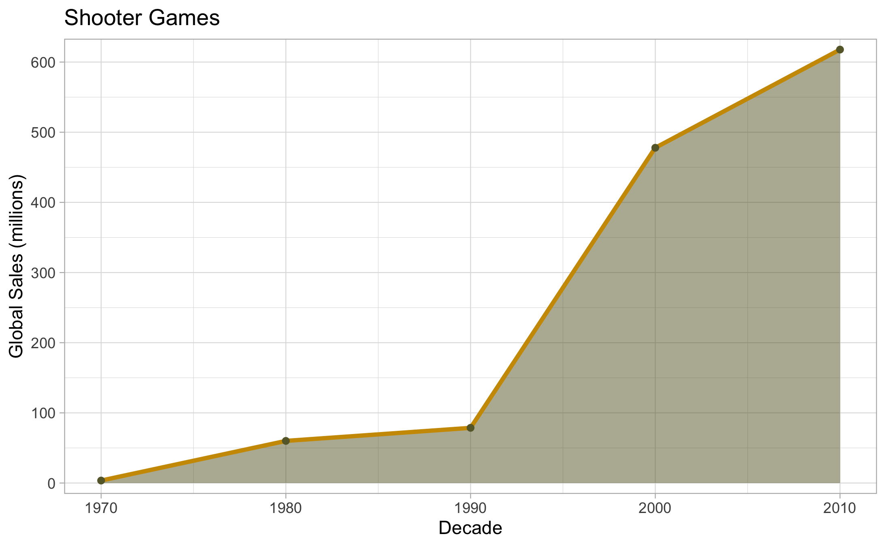

# Video Games Analysis 
# Stuart McColl

 

# Brief

You have been hired by Donkey Games, a small games developer in Dundee. They are planning their next release and want to use data to decide what kind of game to make. They have a dataset that contains historical information on the top selling games of all time.

They want to understand what types of games sell a lot of copies. In particular they are looking for analysis that helps them decide which direction to take their company in.

You’ll need to think carefully about what information is going to be useful to the client.

 

# Visuals

I have included two images of the types of insights and plots you can expect from the full report:

 

# Usage

First of all, the project was completed in RStudio. In order to access the documentation and view the full report

 

